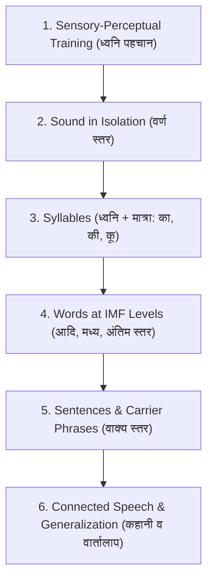

# 🩺 Speech-Language Pathology (SLP) Clinical Guide: Hindi Misarticulation Therapy

## 1. Introduction & Indian Clinical Context

Misarticulation (उच्चारण दोष / तोतलाना / तुतलाना) in children refers to the inability to produce speech sounds correctly according to age-appropriate developmental milestones. In the Indian multilingual ecosystem, Hindi speech sounds have distinct acoustic and articulatory characteristics rooted in Paninian phonetics (वर्णमाला - स्थान व प्रयत्न) that are absent in English articulation materials.

Key distinctions in Hindi:
- **Aspiration Contrast (अल्पप्राण vs महाप्राण)**: e.g., क (/k/) vs ख (/kʰ/), प (/p/) vs फ (/pʰ/).
- **Retroflex vs Dental Contrast (दन्त्य vs मूर्धन्य)**: e.g., त (/t̪/) vs ट (/ʈ/), द (/d̪/) vs ड (/ɖ/).
- **Rhotic Vibrancy (कम्पन ध्वनि)**: /र/ (Alveolar/Retroflex Tap/Trill) vs Lateral /ल/.
- **Sibilant Contrast**: Dental /स/ (/s/) vs Palatal /श/ (/ʃ/).

---

## 2. The S.O.D.A. Error Classification Model

Vaak-Mitra employs the gold-standard SLP S.O.D.A framework adapted for Devanagari phonology:

1. **Substitution (प्रतिस्थापन)**:
   - A target sound is replaced by an erroneous sound.
   - *Examples*: 
     - /र/ -> /ल/ (*Rhotacism / Lambdacism*): 'रोटी' pronounced as 'लोटी'
     - /स/ -> /श/ (*Sigmatism*): 'सांप' pronounced as 'शांप'
     - /क/ -> /त/ (*Velar Fronting*): 'केला' pronounced as 'तेला'
     - /ट/ -> /त/ (*Dentalization*): 'टोपी' pronounced as 'तोपी'

2. **Omission (लोप)**:
   - A target sound is completely omitted from the word.
   - *Example*: 'कमल' pronounced as 'मल', 'पतंग' pronounced as 'पंग'.

3. **Distortion (विकृति)**:
   - The sound is produced unclearly or with lateral air escape (e.g. lateral lisp on /स/).

4. **Addition (आगम)**:
   - An extra intrusive vowel or consonant is inserted (e.g. 'स्कूल' pronounced as 'इस्कूल').

---

## 3. The 6-Stage Traditional Articulation Hierarchy

Vaak-Mitra supports the evidence-based Van Riper Traditional Articulation Therapy Hierarchy:

### IMF (Initial, Medial, Final) Breakdown
- **Initial (आदि)**: Target sound at the beginning of the word (e.g., **के**ला, **रो**टी, **से**ब).
- **Medial (मध्य)**: Target sound inside the word (e.g., म**का**न, ता**रा**, पु**स्त**क).
- **Final (अंतिम)**: Target sound at the end of the word (e.g., ना**क**, घ**र**, ब**स**).

---

## 4. Minimal Pairs Methodology (समान युग्म भेद)

Minimal pairs therapy uses pairs of words that differ by only one single phoneme to demonstrate to the child that changing the sound changes the entire meaning of the word:

- **रोटी (Bread)** vs **लोटी (Small Pot)**: Teaches the child that saying 'लोटी' instead of 'रोटी' creates communicative confusion.
- **ताला (Lock)** vs **टाला (Postponed)**: Highlights dental vs retroflex tongue curl.
- **सांप (Snake)** vs **शाम (Evening)**: Contrasts dental fricative vs palatal fricative.

---

## 5. Parent Guidelines for Home Practice

1. **Daily Short Sessions (15 Minutes)**: Brief, consistent daily practice is much more effective than long, infrequent sessions.
2. **Positive Reinforcement**: Celebrate every close approximation with verbal praise and stars in the app.
3. **No Teasing or Pressure**: Never scold or ridicule misarticulated words; gently model the correct pronunciation (*"हाँ, यह लाल रोटी है!"*).
4. **Mirror Work (मुखाकृति आईना)**: Practice in front of a mirror so the child can visually observe tongue and lip placement alongside the app's anatomical guide.
